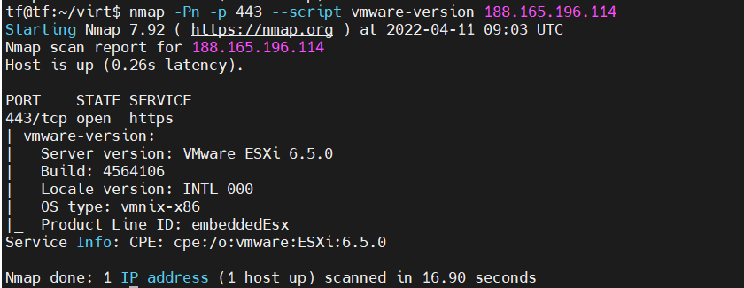
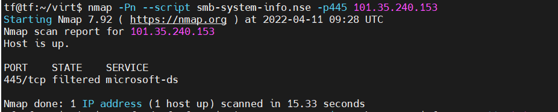

# 虚拟化远程识别

## VMware

nmap --script vmware-version -p443

脚本内容如下
[vmware-version.nse](https://svn.nmap.org/nmap/scripts/vmware-version.nse)
类似脚本还有：
[http-vmware-path-vuln.nse](https://svn.nmap.org/nmap/scripts/http-vmware-path-vuln.nse)

输出结果：

