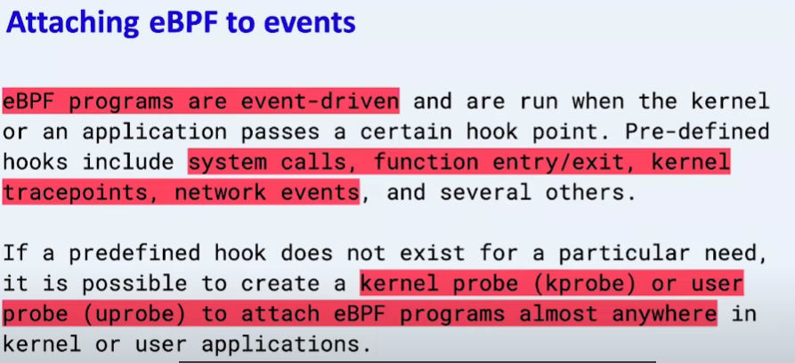
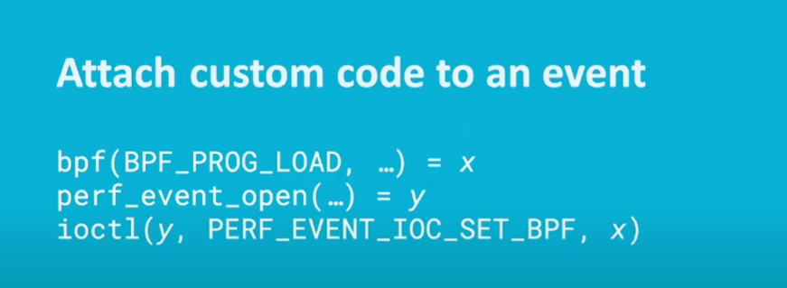
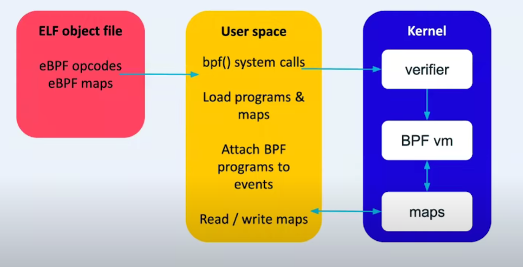
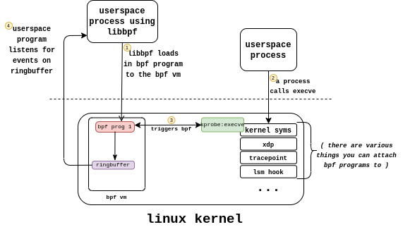

# ebpf











使用场景：保存 tracing 结果
程序示例
1. 保存 perf event：samples/bpf/trace_output_kern.c

```C
// samples/bpf/trace_output_kern.c

struct bpf_map_def SEC("maps") my_map = {
    .type = BPF_MAP_TYPE_PERF_EVENT_ARRAY,
    .key_size = sizeof(int),
    .value_size = sizeof(u32),
    .max_entries = 2,
};

SEC("kprobe/sys_write")
int bpf_prog1(struct pt_regs *ctx)
{
    struct S {
        u64 pid;
        u64 cookie;
    } data;

    data.pid = bpf_get_current_pid_tgid();
    data.cookie = 0x12345678;

    bpf_perf_event_output(ctx, &my_map, 0, &data, sizeof(data));

    return 0;
}
```


### BPF Map是什么
BPF Map本质上是以「键/值」方式存储在内核中的数据结构，它们可以被任何知道它们的BPF程序访问。在内核空间的程序创建BPF Map并返回对应的文件描述符，在用户空间运行的程序就可以通过这个文件描述符来访问并操作BPF Map，这就是为什么BPF Map在BPF世界中是桥梁的存在了。

```
union bpf_attr my_map_attr {
  .map_type = BPF_MAP_TYPE_ARRAY,
  .key_size = sizeof(int),
  .value_size = sizeof(int),
  .max_entries = 1024,
  .map_flags = BPF_F_NO_PREALLOC,
};

int fd = bpf(BPF_MAP_CREATE, &my_map_attr, sizeof(my_map_attr));
```
上面是原生创建BPF Map的代码片段，最初创建BPF Map的方式都是通过bpf系统调用函数（上述代码第9行），传入的第一个参数是BPF_MAP_CREATE，它是创建BPF Map系统调用的代号，第二参数是指定将要创建Map的属性，第三个参数是这个Map配置的大小。因此创建Map之前首先要声明一个BPF Map（上述代码的第1-7行），其中有四大要素：

Map类型（map_type），就是上文提到的各种Map类型
Map的键大小(key_size)，以字节为单位
Map的值大小(value_size)，以字节为单位
Map的元素最大容量(max_entries)，个数为单位

### 简化版BPF Map创建方式
相对于直接使用bpf系统调用函数来创建BPF Map，在实际场景中常用的是一个简化版：

struct bpf_map_def SEC("maps") my_bpf_map = {
  .type       = BPF_MAP_TYPE_HASH, 
  .key_size   = sizeof(int),
  .value_size   = sizeof(int),
  .max_entries = 100,
  .map_flags   = BPF_F_NO_PREALLOC,
};
这个简化版看起来就是一个BPF Map声明，它是如何做到声明即创建的呢？关键点就是SEC("maps")，学名ELF惯例格式（ELF convention），它的工作原理是这样的：

声明ELF Section属性 SEC("maps") （之前的博文里有对Section作用的描述）
内核代码bpf_load.crespect目标文件中所有Section信息，它会扫描目标文件里定义的Section，其中就有用来创建BPF Map的SEC("maps")，我们可以到相关代码里看到说明：


如何操作BPF Map
BPF Map也有自己的CRUD，除了bpf_map_create是创建BPF Map操作之外，下面列出了其他主要操作，

bpf_map_lookup_elem(map, key)函数，通过key查询BPF Map，得到对应value
bpf_map_update_elem(map, key, value, options)函数，通过key-value更新BPF Map，如果这个key不存在，也可以作为新的元素插入到BPF Map中去
bpf_map_get_next_key(map, lookup_key, next_key)函数，这个函数可以用来遍历BPF Map，下文有具体的介绍。
## 参考链接


libbpfgo


[libbpfgo-example](https://github.com/grantseltzer/libbpfgo-example)

[BPF 进阶笔记（二）：BPF Map 类型详解：使用场景、程序示例](https://arthurchiao.art/blog/bpf-advanced-notes-2-zh/)

[[译] [论文] XDP (eXpress Data Path)：在操作系统内核中实现快速、可编程包处理（ACM，2018）](https://arthurchiao.art/blog/xdp-paper-acm-2018-zh/)
[BPF 进阶笔记（一）：BPF 程序（BPF Prog）类型详解：使用场景、函数签名、执行位置及程序示例](https://arthurchiao.art/blog/bpf-advanced-notes-1-zh/)
[BPF数据传递的桥梁——BPF MAP（一）](https://davidlovezoe.club/wordpress/archives/1044)
[linux, ebpf, go, security](https://www.grant.pizza/)
[eBPF Map 操作](https://houmin.cc/posts/98a3c8ff/)
[使用 Go 语言开发 ebpf 程序](https://houmin.cc/posts/adca5ae5/)

["eBPF 101" - Muhammad Falak R Wani (LCA 2022 Online)](https://www.youtube.com/watch?v=n6SdBmgLFmA)

