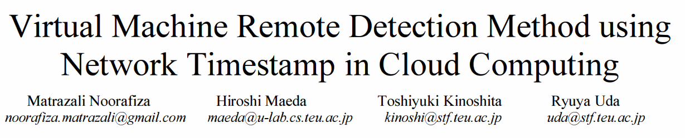
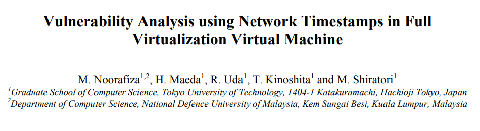
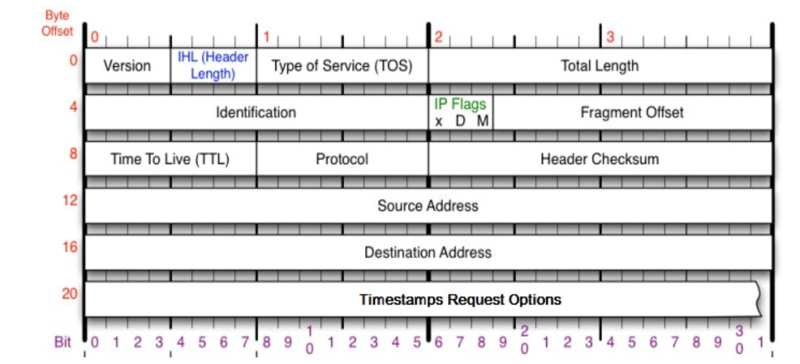
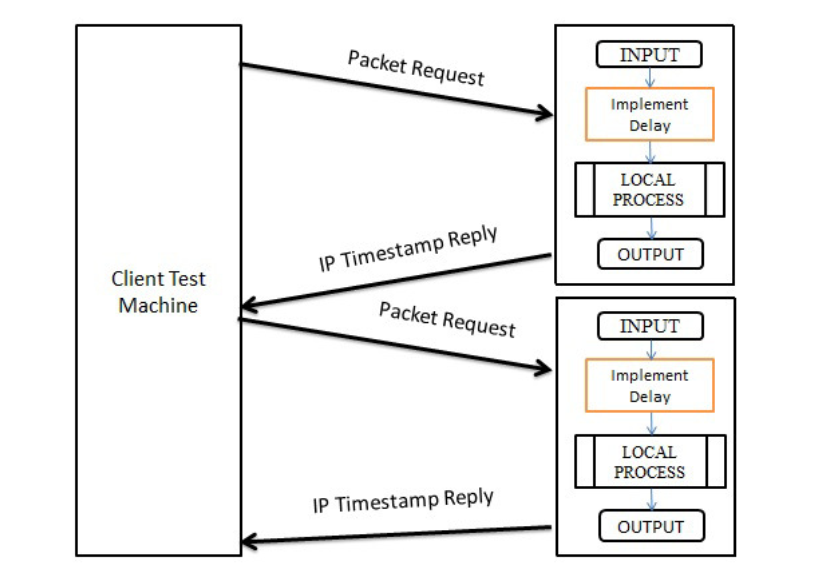

# 使用IP时间戳模式特性检测虚拟机类型
---
## 整体介绍
- 通过远程检测VM，而无需在目标机器上安装任何程序。它通过分析从目标机器发送的响应中的IP时间戳模式来确定目标机器是真实机器还是虚拟机

- 通过分析来自目标机器的响应中的IP时间戳模式，我们能够区分VM和真正的机器环境。也就是说，我们的实验结果证明了应答报文中存在一个特征的IP时间戳模式，

---

## 研究背景
- vm通常被用作恶意软件检测的蜜罐或模拟器
- 恶意软件可能检测到它正在或将要运行的系统，从而区分VM环境。
- 通过VM检测，攻击者可以设计恶意软件，在执行任何恶意或安全破坏操作之前，首先尝试检测系统是否在VM上运行

---

## 相关研究

- 大部分虚拟机类型检测聚焦于虚拟机内部检测
- A VM detection method that uses network timestamps was first suggested [Remote physical device fingerprinting](https://homes.cs.washington.edu/~yoshi/papers/PDF/KoBrCl2005PDF-Extended-lowres.pdf)
    - 其中，TCP时间戳用作隐蔽通道，以揭示目标主机的物理时钟偏移 
- 一个数据包中两种不同的时间戳ICMP和IP之间的差异被用来确定VM的存在
    - 然而，随着高性能PC和高速网络连接的快速发展，这种情况已变得不适用
- 在我们之前的一篇[论文](https://www.researchgate.net/publication/271548228_Virtual_machine_remote_detection_method_using_network_timestamp_in_cloud_computing)中，我们展示了对于类型2虚拟机管理程序，客户端测试机器接收到的回复IP时间戳信息表明，与真实机器的IP时间戳相比，不同的行为。
- 在另一篇[论文]()中，我们证明了1型虚拟机监控程序的IP时间戳模式也显示了真实机器和虚拟机之间的明显差异
---
## 相关研究

---

## 背景知识

- IP被设计为使用IP选项支持可扩展性  
- IP时间戳选项是存储在IP头中的可变长度数据，允许发送者请求任何通过指定IP地址来处理数据包的目标计算机的时间戳值

---
## 背景知识
- Hypervisor支持创建一个虚拟网络，将虚拟网卡连接到由虚拟交换机组成的网络
- 这些虚拟网络连接到物理网卡。通过网络，虚拟机中的应用可以与主机外的服务进行连接
- 应用程序向客户操作系统发送网络请求，客户操作系统通过虚拟交换机传递请求。然后，虚拟机监控程序从网络模拟器获取请求，并通过物理网卡将其发送到网络
- 因此，虚拟化给网络环境增加了许多问题，真实的机器和vm会在应答的数据包中显示IP时间戳的差异。

---
## 猜想

- 真实的机器和vm会在应答的数据包中显示IP时间戳的差异
- 我们预测，与vm相比，真实机器中的差异会更小，因为在队列中操作vm之间切换会导致vm具有相对较慢的IP时间戳响应模式。此外，虚拟机时钟是使用称为虚拟机交换机的计时器设备仿真来管理的。这将导致来自虚拟机的应答数据包之间的时间戳存在显著差异

---
## 远程检测方法及对策

#### 总体思路
利用VM回复包中的IP时间戳信息

