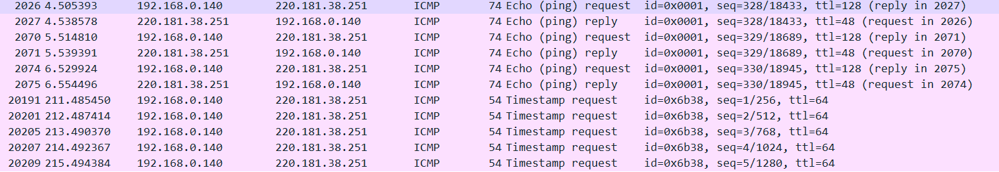

# 使用IP时间戳模式特性检测虚拟机类型
---
## 整体介绍
- 通过远程检测VM，而无需在目标机器上安装任何程序。它通过分析从目标机器发送的响应中的IP时间戳模式来确定目标机器是真实机器还是虚拟机

- 通过分析来自目标机器的响应中的IP时间戳模式，我们能够区分VM和真正的机器环境。也就是说，我们的实验结果证明了应答报文中存在一个特征的IP时间戳模式，

---

## 研究背景
- vm通常被用作恶意软件检测的蜜罐或模拟器
- 恶意软件可能检测到它正在或将要运行的系统，从而区分VM环境。
- 通过VM检测，攻击者可以设计恶意软件，在执行任何恶意或安全破坏操作之前，首先尝试检测系统是否在VM上运行

---

## 相关研究

- 大部分虚拟机类型检测聚焦于虚拟机内部检测
- A VM detection method that uses network timestamps was first suggested [Remote physical device fingerprinting](https://homes.cs.washington.edu/~yoshi/papers/PDF/KoBrCl2005PDF-Extended-lowres.pdf)
    - 其中，TCP时间戳用作隐蔽通道，以揭示目标主机的物理时钟偏移 
- 一个数据包中两种不同的时间戳ICMP和IP之间的差异被用来确定VM的存在
    - 然而，随着高性能PC和高速网络连接的快速发展，这种情况已变得不适用
- 在我们之前的一篇[论文](https://www.researchgate.net/publication/271548228_Virtual_machine_remote_detection_method_using_network_timestamp_in_cloud_computing)中，我们展示了对于类型2虚拟机管理程序，客户端测试机器接收到的回复IP时间戳信息表明，与真实机器的IP时间戳相比，不同的行为。
- 在另一篇[论文]()中，我们证明了1型虚拟机监控程序的IP时间戳模式也显示了真实机器和虚拟机之间的明显差异
---
## 相关研究

我们已经证明，来自虚拟机所在主机的数据包的IP时间戳差异大于真实机器。VM操作有时暂停，以便完成其他来宾操作

---

## 背景知识

- IP被设计为使用IP选项支持可扩展性  
- IP时间戳选项是存储在IP头中的可变长度数据，允许发送者请求任何通过指定IP地址来处理数据包的目标计算机的时间戳值

---
## 背景知识
- Hypervisor支持创建一个虚拟网络，将虚拟网卡连接到由虚拟交换机组成的网络
- 这些虚拟网络连接到物理网卡。通过网络，虚拟机中的应用可以与主机外的服务进行连接
- 应用程序向客户操作系统发送网络请求，客户操作系统通过虚拟交换机传递请求。然后，虚拟机监控程序从网络模拟器获取请求，并通过物理网卡将其发送到网络
- 因此，虚拟化给网络环境增加了许多问题，真实的机器和vm会在应答的数据包中显示IP时间戳的差异。

---
## 猜想

- 真实的机器和vm会在应答的数据包中显示IP时间戳的差异
- 我们预测，与vm相比，真实机器中的差异会更小，因为在队列中操作vm之间切换会导致vm具有相对较慢的IP时间戳响应模式。此外，虚拟机时钟是使用称为虚拟机交换机的计时器设备仿真来管理的。这将导致来自虚拟机的应答数据包之间的时间戳存在显著差异

---
## 远程检测方法及对策

 

利用VM回复包中的IP时间戳信息差异，可以区分vm和真实机器的IP时间戳模式

---
## 远程检测方法及对策

#### 总体思路

- 根据实验中发现的时间戳模式差异绘制分布图
- 然后，我们使用我们的延迟修改技术设计了一个解决方案，其中使真正的机器显示与VM相同的IP时间戳应答模式
    - 当带有IP时间戳选项的数据包到达真实机器时，它们在被转发到操作系统进行处理之前会使用对策延迟
    - 解决了利用时间戳进行虚拟机攻击的可能性 

---
## 测试方法
- 所有主要的商业hypervisor产品，都被实现来承载VM测试机器
- 在报头中发送开启了IP时间戳选项的请求包
- 通过执行为本实验开发的定制脚本，从测试客户端机器发送数据包。
- 记录并编译来自目标机的应答包中的时间戳信息
- IP时间戳以十进制单位分析到最近的毫秒

---
## 过程分析

- 通过执行为本实验开发的定制脚本，从测试客户端机器发送数据包
- 只有在测量机收到前一个包请求的回复后，客户端测试机的下一个请求包才被发送到目标主机
- 每个目标操作系统都添加了自己的时间戳，并且数据包中的时间戳在到达客户机之前不会受到网络的影响
- 分析来自测量目标机的IP时间戳信息，绘制分布图，观察目标客户的时间戳差异

---
## 数据分析

我们对收集到的数据进行分析，了解目标主机时间戳行为的差异。时间戳是从测试客户端机器中的每个目标主机的应答包中提取的。
- 如图所示的顺序从发送的第一个包n开始，一直到第20个包n + 19。
- 对于真正的机器，前三个应答报文的时间戳是相同的，之后的五个应答报文的时间戳也是相同的。

---
## 数据分析

右图在来自目标主机的应答包的序列中，相同的时间戳被标记了多少次。
- 真实机器的相同时间戳的平均重复次数几乎为4.50次，而VM目标主机的平均重复值更小
- 不同的虚拟机监控程序技术具有不同的时间戳行为模式

---

## 数据分析

- 表中显示的是对真实机器和虚拟机的全部100万条应答报文的分析结果。我们计算了真实机器和虚拟机的应答报文中相同IP时间戳重复的平均次数
- 平均值显示了IP时间戳模式的显著差异

---
## 结论
- 真实机器的相同时间戳的平均重复次数几乎为4.50次，而VM目标主机的平均重复值更小。
- 据此，我们可以确定vm和real machine在IP时间戳行为上存在显著差异。
- 这些结果支持我们的假设，即由于VM数据包是通过管理程序处理的，因此来自VM环境的应答数据包中会出现时间戳延迟。而且，正如预期的那样，不同的虚拟机监控程序技术具有不同的时间戳行为模式。
- 因此，可以使用IP时间戳模式远程检测vm

---

## 实践

- The usual ping command uses ECHO REQUEST and ECHO REPLY, as you've seen. It does indeed locally keep track of sent time and matches with the incoming reply to determine the round trip time.

- TIMESTAMP and TIMESTAMP REPLY are pretty rare, and many sites simply don't answer, as many systems managers believe it to be a security issue, albeit minor. The purpose of the packets is to separate out the the times of the outgoing trip, the far end processing time, and the return trip. ICMP in general is subject to all kinds of manipulations and blockages by intervening routers, so it can be hard to read much into the results if you're using this across a network you don't control.

To send them you can use a utility such as nping from the nmap set of tools. It can be used for all kinds of exotic ping-like tests.

- nping --icmp --icmp-type 13 www.google.com

www.google.com won't reply to these, but your packet capture will show them being sent.

---
## ping IP request 

---
## nping timestamp request

---
## wireshark info 

---
## using nping test my cvm

---
## using nmap directly

---

## timestamp 介绍

- Type must be set to 14
- Code must be set to 0
- Identifier and Sequence number can be used by the client to match the reply with the request that caused the reply.
- Originate timestamp is the time the sender last touched the message before sending it.
- Receive timestamp is the time the echoer first touched it on receipt.
- Transmit timestamp is the time the echoer last touched the message on sending it.